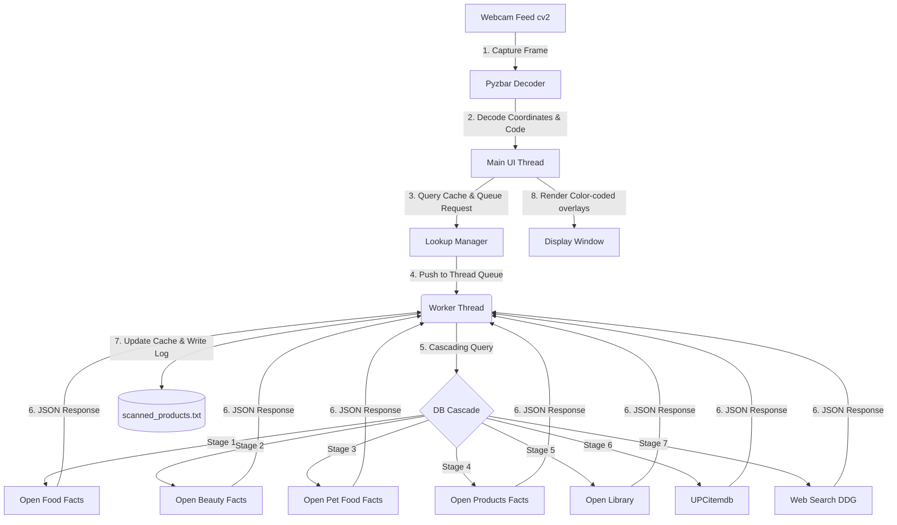

# Smart Webcam Barcode & QR Code Reader 🏷️🔍

A real-time, multi-threaded Python application that uses your webcam to detect barcodes and QR codes, looks up product details instantly using a **7-stage cascading multi-API architecture**, displays product names live on the camera overlay, and logs all scans locally.

Designed with a **non-blocking asynchronous architecture**, the video feed remains buttery-smooth (30+ FPS) even while network lookups are being made in the background.

---

## 🌟 Key Features

*   📷 **Real-time Detection**: Captures and processes webcam frames instantly using OpenCV.
*   ⚡ **Zero-Lag Interface**: Multi-threaded request worker scans and queries in the background, preventing video frame stutter.
*   🌐 **7-Stage Cascading Multi-API Lookup**: Queries multiple databases sequentially to resolve food, books, personal care, pet items, toys, and general retail goods:
    1.  **Open Food Facts API**: For groceries and food products.
    2.  **Open Beauty Facts API**: For cosmetics, shampoos, soaps, and personal care.
    3.  **Open Pet Food Facts API**: For pet food, treats, and pet care products.
    4.  **Open Products Facts API**: For miscellaneous consumer products (toys, games, stationery).
    5.  **Open Library API**: For books, novels, and textbooks using ISBN numbers.
    6.  **UPCitemdb API**: General retail backup for books, electronics, tools, home goods, apparel, etc. (no key required for standard rate-limited lookup).
    7.  **DuckDuckGo HTML Web Search**: Global search engine fallback. Scrapes web results to identify regional or niche items.
*   🎨 **Sleek Overlay HUD**: Automatically draws color-coded bounding boxes and semi-transparent info badges above barcodes based on API query status.
*   💾 **Local File Logging**: Saves all scanned products to a structured log file `scanned_products.txt` with timestamps and database source info.
*   ⚙️ **Dual-Engine Parser**: Uses `pyzbar` as primary engine, with a automatic, seamless fallback to OpenCV's built-in `BarcodeDetector`/`QRCodeDetector` if system C-libraries are missing.

---

## ⚙️ Architecture

The app uses a worker thread queue pattern to maintain UI responsiveness:



---


## 💻 Usage

To run the barcode scanner, execute the script:

```bash
python barcode_scanner.py
```

### Controls:
*   **Hold a product barcode or QR code** up to your webcam.
*   The camera feed will automatically highlight the code:
    *   🟡 **Yellow Box**: Lookup pending (querying cascading APIs in the background).
    *   🟢 **Green Box**: Product found and successfully resolved.
    *   🔴 **Red Box**: Product not found in any database.
    *   🟠 **Orange Box**: API/Network connection error occurred.
*   Press **`q`** in the video window to stop the scanner and exit cleanly.

---

## 📊 Scanned Log Format

Successful lookups are instantly appended to `scanned_products.txt` in the root folder. Each log entry is structured as follows:

```text
[YYYY-MM-DD HH:MM:SS] Barcode: <barcode> | Status: FOUND | DbSource: <source_db> | Product: <product_name> (<brand>)
[YYYY-MM-DD HH:MM:SS] Barcode: <barcode> | Status: NOT_FOUND | DbSource: None | Product: Product Not Found
```

Example:
```text
[2026-07-30 23:04:12] Barcode: 3017624010701 | Status: FOUND | DbSource: Open Food Facts | Product: Nutella (Ferrero)
[2026-07-30 23:04:45] Barcode: 9780132350884 | Status: FOUND | DbSource: Open Library | Product: Clean Code by Robert C. Martin
```
