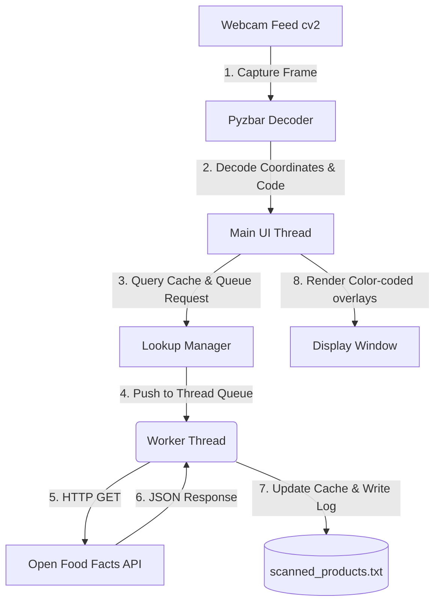

# Smart Webcam Barcode & QR Code Reader 🏷️🔍

A real-time, multi-threaded Python application that uses your webcam to detect barcodes and QR codes, looks up food products instantly using the **Open Food Facts API**, displays product names live on the camera overlay, and logs all scans locally.

Designed with a **non-blocking asynchronous architecture**, the video feed remains buttery-smooth (30+ FPS) even while network lookups are being made.

---

## 🌟 Key Features

*   📷 **Real-time Detection**: Captures and processes webcam frames instantly using OpenCV.
*   ⚡ **Zero-Lag Interface**: Multi-threaded request worker scans and queries in the background, preventing video frame stutter.
*   📦 **Open Food Facts Integration**: Dynamically fetches product names, brands, and categories directly from the Open Food Facts API (no API key required).
*   🎨 **Sleek Overlay HUD**: Automatically draws color-coded bounding boxes and semi-transparent info badges above barcodes based on API query status.
*   💾 **Local File Logging**: Saves all scanned products to a structured log file `scanned_products.txt` with timestamps.
*   🌐 **QR & Barcode Support**: Decodes QR Codes, EAN-13, UPC-A, Code-128, and more via `pyzbar`.

---

## ⚙️ Architecture

The app uses a worker thread queue pattern to maintain UI responsiveness:



---

## 🚀 Installation & Setup

### 1. Prerequisites

The decoding engine is powered by **ZBar**. You must ensure the ZBar shared library is installed on your operating system:

*   **Windows**: The `pyzbar` library automatically installs ZBar DLLs within its Python wheel. No manual steps are required.
*   **macOS**: Install ZBar using Homebrew:
    ```bash
    brew install zbar
    ```
*   **Linux (Ubuntu/Debian)**: Install the ZBar package:
    ```bash
    sudo apt-get install libzbar0
    ```

### 2. Setup Project Environment

Clone or download this repository, and navigate into the folder:

```bash
cd "Bar code reader"
```

Create a virtual environment (recommended):

```bash
# Windows
python -m venv venv
venv\Scripts\activate

# macOS / Linux
python3 -m venv venv
source venv/bin/activate
```

Install python dependencies:

```bash
pip install -r requirements.txt
```

---

## 💻 Usage

To run the barcode scanner, execute the script:

```bash
python barcode_scanner.py
```

### Controls:
*   **Hold a product barcode or QR code** up to your webcam.
*   The camera feed will automatically highlight the code:
    *   🟡 **Yellow Box**: Lookup pending (querying API in the background).
    *   🟢 **Green Box**: Product found and successfully resolved.
    *   🔴 **Red Box**: Product not found in Open Food Facts database.
    *   🟠 **Orange Box**: API/Network connection error occurred.
*   Press **`q`** in the video window to stop the scanner and exit cleanly.

---

## 📊 Scanned Log Format

Successful lookups are instantly appended to `scanned_products.txt` in the root folder. Each log entry is structured as follows:

```text
[YYYY-MM-DD HH:MM:SS] Barcode: <barcode> | Status: FOUND | Product: <product_name> (<brand>)
[YYYY-MM-DD HH:MM:SS] Barcode: <barcode> | Status: NOT_FOUND | Product: Product Not Found
```

Example:
```text
[2026-07-30 17:23:45] Barcode: 3017624010701 | Status: FOUND | Product: Nutella (Ferrero)
[2026-07-30 17:24:12] Barcode: 5449000000996 | Status: FOUND | Product: Coca-Cola (Coca-Cola)
```

---

## 🛠️ Customization

You can change the API User-Agent header in `barcode_scanner.py` to identify your custom app version according to Open Food Facts guidelines:

```python
session.headers.update({
    "User-Agent": "MyScannerApp/2.0 (contact: info@example.com)"
})
```

You can also change the video input source or resolution inside `main()`:
```python
cap = cv2.VideoCapture(0) # Change index if using external camera
cap.set(cv2.CAP_PROP_FRAME_WIDTH, 1920) # Change width
cap.set(cv2.CAP_PROP_FRAME_HEIGHT, 1080) # Change height
```
