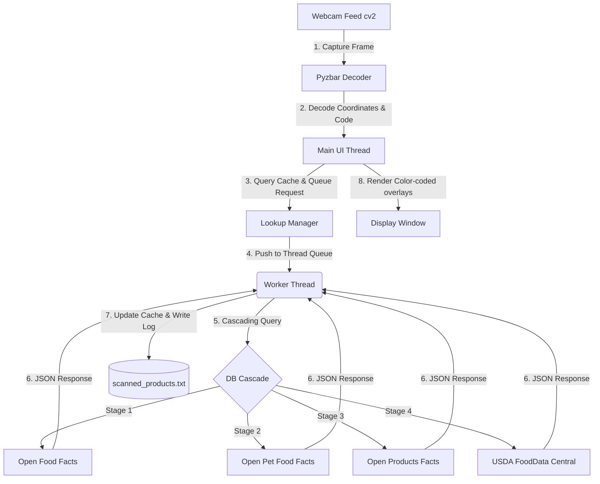

# Smart Webcam Barcode & QR Code Reader 🏷️🔍

A real-time, multi-threaded Python application that uses your webcam to detect barcodes and QR codes, looks up product details instantly using a **4-stage cascading multi-API architecture**, displays product names live on the camera overlay, and logs all scans locally.

Designed with a **non-blocking asynchronous architecture**, the video feed remains buttery-smooth (30+ FPS) even while network lookups are being made in the background.

---

## 🌟 Key Features

*   📷 **Real-time Detection**: Captures and processes webcam frames instantly using OpenCV.
*   🎯 **Dedicated Scan Window**: A centred targeting rectangle marks exactly where to hold the product. Everything outside it is dimmed and **not decoded at all**, so background clutter can never produce a false read — and because only the small window is processed, each frame is decoded at a much higher effective zoom, which is what lets small printed barcodes resolve. Resizable live with `+`/`-`.
*   ⚡ **Zero-Lag Interface**: Multi-threaded request worker scans and queries in the background, preventing video frame stutter.
*   🌐 **4-Stage Cascading Multi-API Lookup**: Queries databases sequentially to resolve food, pet items, and general consumer goods:
    1.  **Open Food Facts API**: For groceries and food products.
    2.  **Open Pet Food Facts API**: For pet food, treats, and pet care products.
    3.  **Open Products Facts API**: For miscellaneous consumer products (toys, games, stationery, etc.).
    4.  **USDA FoodData Central API**: For US-branded food items and nutritional details.
*   🎨 **Sleek Overlay HUD**: Automatically draws color-coded bounding boxes and semi-transparent info badges above barcodes based on API query status.
*   💾 **Local File Logging**: Saves all scanned products to a structured log file `scanned_products.txt` with timestamps and database source info.
*   ⚙️ **Dual-Engine Parser**: Uses `pyzbar` as primary engine, with a automatic, seamless fallback to OpenCV's built-in `BarcodeDetector`/`QRCodeDetector` if system C-libraries are missing.

---

## ⚙️ Architecture

The app uses a worker thread queue pattern to maintain UI responsiveness:



---

## 🎯 How the Scan Window Works

Rather than decoding the entire camera image, the app decodes **only the centred rectangle**. This is the core of how it stays accurate:

```
┌───────────────────────────────────────────────┐
│  [Q] Quit  [+/-] Box size  [F] Full frame     │  ← controls bar
│░░░░░░░░░░░░░░░░░░░░░░░░░░░░░░░░░░░░░░░░░░░░░░│
│░░░░░░┏━━                             ━━┓░░░░░│
│░░░░░░┃                                 ┃░░░░░│  ← bright = decoded
│░░░░░░┃        ▌▌│▌│▌▌│▌│▌▌│▌          ┃░░░░░│
│░░░░░░┃  ·············································  ← sweep line
│░░░░░░┗━━                             ━━┛░░░░░│
│░░░░░░░░░ Align the barcode inside this box ░░░│  ← dimmed = ignored
│  3017624010701  ->  Nutella (Ferrero)         │  ← result bar
└───────────────────────────────────────────────┘
```

Three things fall out of this design:

1. **No false reads from clutter.** Codes outside the rectangle are never passed to the decoder, so a barcode on a shelf behind the product cannot be picked up by accident.
2. **Higher effective zoom.** Because only a small crop is processed, the upscale pass can enlarge it toward ~1000px wide — which is what makes small printed barcodes resolve at all.
3. **Cheaper frames.** A smaller region means each of the four decode passes costs less, keeping the feed smooth.

Inside the window, the decoder escalates through four passes and stops at the first one that reads: **raw grayscale → Otsu binarisation** (fixes poor contrast) **→ sharpening** (fixes motion blur) **→ upscaling** (fixes small or distant codes).

---


