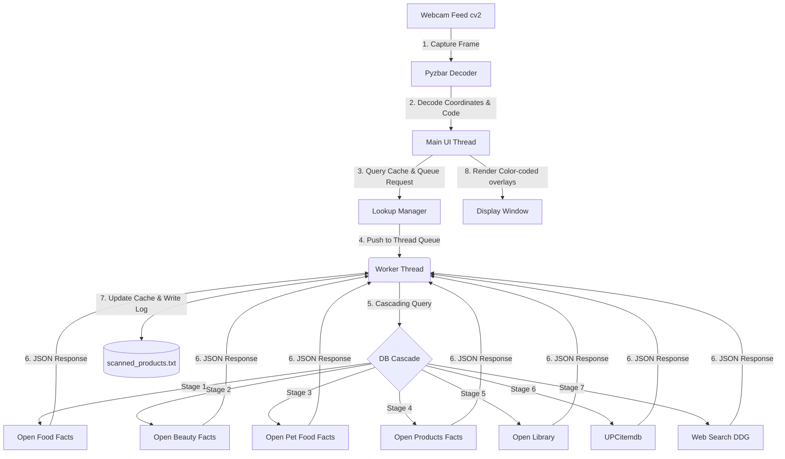

# Smart Webcam Barcode & QR Code Reader 🏷️🔍

A real-time, multi-threaded Python application that uses your webcam to detect barcodes and QR codes, looks up product details instantly using a **7-stage cascading multi-API architecture**, displays product names live on the camera overlay, and logs all scans locally.

Designed with a **non-blocking asynchronous architecture**, the video feed remains buttery-smooth (30+ FPS) even while network lookups are being made in the background.

---

## 🌟 Key Features

*   📷 **Real-time Detection**: Captures and processes webcam frames instantly using OpenCV.
*   🎯 **Dedicated Scan Window**: A centred targeting rectangle marks exactly where to hold the product. Everything outside it is dimmed and **not decoded at all**, so background clutter can never produce a false read — and because only the small window is processed, each frame is decoded at a much higher effective zoom, which is what lets small printed barcodes resolve. Resizable live with `+`/`-`.
*   ⚡ **Zero-Lag Interface**: Multi-threaded request worker scans and queries in the background, preventing video frame stutter.
*   🌐 **7-Stage Cascading Multi-API Lookup**: Queries multiple databases sequentially to resolve food, books, personal care, pet items, toys, and general retail goods:
    1.  **Open Food Facts API**: For groceries and food products.
    2.  **Open Beauty Facts API**: For cosmetics, shampoos, soaps, and personal care.
    3.  **Open Pet Food Facts API**: For pet food, treats, and pet care products.
    4.  **Open Products Facts API**: For miscellaneous consumer products (toys, games, stationery).
    5.  **Open Library API**: For books, novels, and textbooks using ISBN numbers.
    6.  **UPCitemdb API**: General retail backup for books, electronics, tools, home goods, apparel, etc. (no key required for standard rate-limited lookup).
    7.  **DuckDuckGo HTML Web Search**: Global search engine fallback. Scrapes web results to identify regional or niche items.
*   🎨 **Sleek Overlay HUD**: Automatically draws color-coded bounding boxes and semi-transparent info badges above barcodes based on API query status.
*   💾 **Local File Logging**: Saves all scanned products to a structured log file `scanned_products.txt` with timestamps and database source info.
*   ⚙️ **Dual-Engine Parser**: Uses `pyzbar` as primary engine, with a automatic, seamless fallback to OpenCV's built-in `BarcodeDetector`/`QRCodeDetector` if system C-libraries are missing.

---

## ⚙️ Architecture

The app uses a worker thread queue pattern to maintain UI responsiveness:



---

## 🎯 How the Scan Window Works

Rather than decoding the entire camera image, the app decodes **only the centred rectangle**. This is the core of how it stays accurate:

```
┌───────────────────────────────────────────────┐
│  [Q] Quit  [+/-] Box size  [F] Full frame     │  ← controls bar
│░░░░░░░░░░░░░░░░░░░░░░░░░░░░░░░░░░░░░░░░░░░░░░│
│░░░░░░┏━━                             ━━┓░░░░░│
│░░░░░░┃                                 ┃░░░░░│  ← bright = decoded
│░░░░░░┃        ▌▌│▌│▌▌│▌│▌▌│▌          ┃░░░░░│
│░░░░░░┃  ·············································  ← sweep line
│░░░░░░┗━━                             ━━┛░░░░░│
│░░░░░░░░░ Align the barcode inside this box ░░░│  ← dimmed = ignored
│  3017624010701  ->  Nutella (Ferrero)         │  ← result bar
└───────────────────────────────────────────────┘
```

Three things fall out of this design:

1. **No false reads from clutter.** Codes outside the rectangle are never passed to the decoder, so a barcode on a shelf behind the product cannot be picked up by accident.
2. **Higher effective zoom.** Because only a small crop is processed, the upscale pass can enlarge it toward ~1000px wide — which is what makes small printed barcodes resolve at all.
3. **Cheaper frames.** A smaller region means each of the four decode passes costs less, keeping the feed smooth.

Inside the window, the decoder escalates through four passes and stops at the first one that reads: **raw grayscale → Otsu binarisation** (fixes poor contrast) **→ sharpening** (fixes motion blur) **→ upscaling** (fixes small or distant codes).

---

## 🚀 Installation & Setup

### 1. Prerequisites

The primary decoding engine is powered by **ZBar**:

*   **Windows**: `pyzbar` ships ZBar DLLs in its wheel. If you hit a DLL load error, install the [Visual C++ Redistributable 2013](https://www.microsoft.com/en-us/download/details.aspx?id=40784). The app will run without it, falling back to OpenCV's built-in detectors.
*   **macOS**: `brew install zbar`
*   **Linux (Ubuntu/Debian)**: `sudo apt-get install libzbar0`

### 2. Setup Project Environment

```bash
python -m venv venv
```

Activate it — Windows `venv\Scripts\activate`, macOS/Linux `source venv/bin/activate` — then install dependencies:

```bash
pip install -r requirements.txt
```

---

## 💻 Usage

```bash
python barcode_scanner.py
```

### Controls

**Hold the product so its barcode sits inside the on-screen rectangle.** Only that region is decoded; the dimmed area around it is ignored.

| Key | Action |
| :-- | :-- |
| `Q` / `Esc` | Quit and shut down cleanly |
| `+` / `-` | Grow / shrink the scan window |
| `F` | Toggle full-frame mode (decode the whole image, no window) |
| `R` | Reset the scan window to its default size |

The rectangle is **colour-coded** by lookup status, and the bottom bar holds the last result on screen for a few seconds after you move the product away:

*   ⚪ **Grey** — Idle, waiting for a code. A sweeping line shows the decoder is live.
*   🟡 **Yellow** — Lookup pending (querying the cascading APIs in the background).
*   🟢 **Green** — Product found and resolved.
*   🔴 **Red** — Not found in any of the 7 sources.
*   🟠 **Orange** — API / network error.

> **Tip:** If a barcode won't read, shrink the window with `-` so the code fills more of it — that raises the zoom the decoder works at. Codes read best when they span most of the box width. Press `F` if you'd rather scan freely without the window.

---

## 📊 Scanned Log Format

Lookups are appended to `scanned_products.txt`:

```text
[YYYY-MM-DD HH:MM:SS] Barcode: <barcode> | Status: FOUND | DbSource: <source_db> | Product: <product_name> (<brand>)
[YYYY-MM-DD HH:MM:SS] Barcode: <barcode> | Status: NOT_FOUND | DbSource: None | Product: Product Not Found
```

Example:

```text
[2026-07-30 23:04:12] Barcode: 3017624010701 | Status: FOUND | DbSource: Open Food Facts | Product: Nutella (Ferrero)
[2026-07-30 23:04:45] Barcode: 9780132350884 | Status: FOUND | DbSource: Open Library | Product: Clean Code by Robert C. Martin
```


